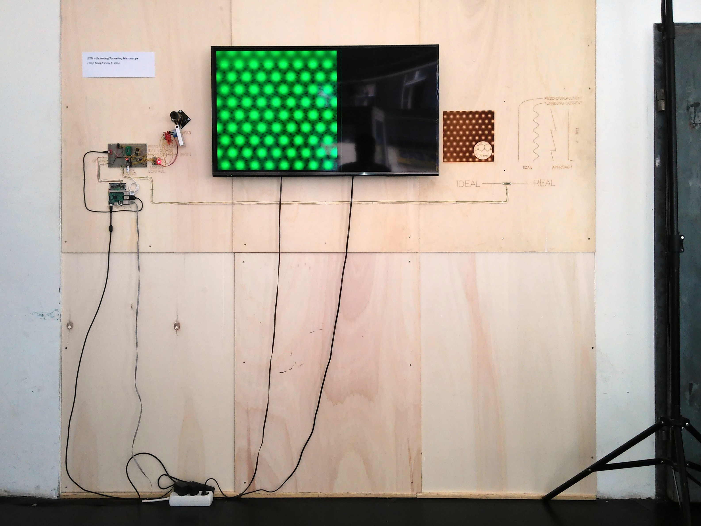

Instructions
============

 1. Build and upload Arduino sketch `microcontroller` to Teensy 3 or
    compatible.

 2. List available serial ports for communication with the Teensy:

        $ cd server/
        $ npm start

 3. Start server, here with serial port `COM59`:

        $ npm start COM59

 4. Open index page in browser, in full screen mode on a 16:9 screen. Example
    URL (adapt to your system):

        http://localhost:8080

Coding conventions
==================

  * Maximum line length: 80 characters

  * Comments in Markdown

  * JavaScript passes JSLint.

Legal
=====

Unless mentioned otherwise, stuff is licensed under the WTFPL version 2:
<http://www.wtfpl.net/>
